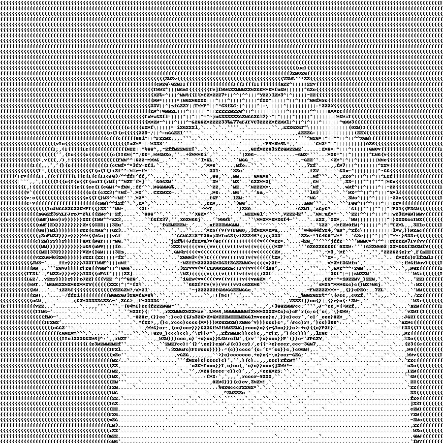
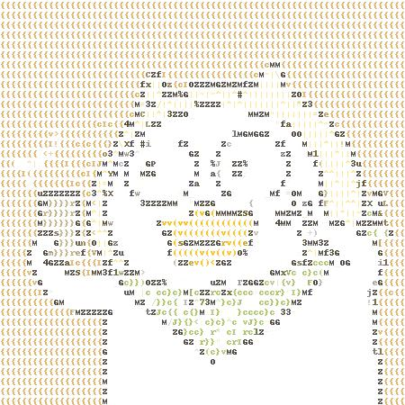
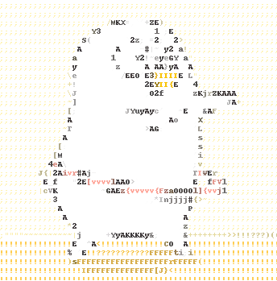
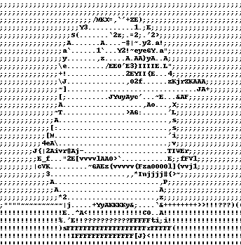
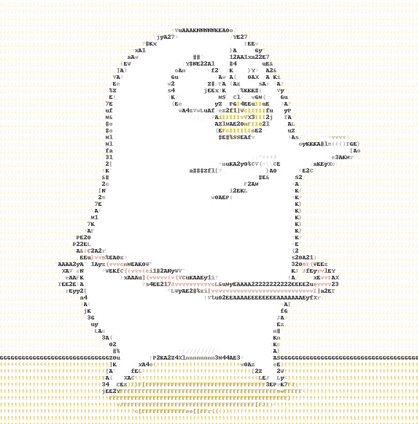

# Ascii Art #
把图片对应的字符画或文本。  
把视频转为由字符画构成的视频。
<p align="center">
	
	<br/>
</p>

[简体中文](./README-cn.md)  
[English](./README.md)

## 介绍 ##
灵感来源 [ASCII-generator](https://github.com/uvipen/ASCII-generator). 
这个工具某些方面挺好的，但是在转换视频时有一些问题比如：速度太慢、输出没有音频。

## 特点 ##
* :zap: **充分利用CPU**. 为了缩短转换视频的时间，我用了python中的多进程去处理每一帧。
* :musical_note: **有音频**. 输出的视频与输入有相同的音频。
* :warning: **注意内存使用量！**. 处理视频时内存占用量稍大。(500帧 1080P的视频最高时占用3GB)

## 所需软件与库 ##
`pip install opencv-python Pillow moviepy numpy`
* **python3.8** (python >= 3.6 应该都可以)
* **opencv**
* **Pillow**
* **moviepy**
* **numpy** (一般来说安装opencv的时候会自动安装上)  

## 用法 ##
```
usage: ascii_art.py [-h] [-i INPUT] [-o OUTPUT] [-c] [-s SCALE] [--no-audio]

Convert image(video) to image(video)

optional arguments:
  -h, --help			展示帮助信息
  -i INPUT, --input INPUT	输入文件路径
  -o OUTPUT, --output OUTPUT	输出文件路径
  -c, --color 			加上表示输出彩色，否则就是灰度图
  -s SCALE, --scale SCALE 	输入和输出分辨率比例，越高越清晰，但输出也越大(默认是1)
  --no-audio			不需要音频则加上这个
```

## 例子 ##
### 从图像到图像 ###
```python
# 如果想要从图像到图像的转换，或者从视频到视频的转换，-o选项可以不写，会自动根据输入文件名输出对应的文件。
python ascii_art.py -i pic/xly.jpg  -o xly_100.jpg -c 
python ascii_art.py -i pic/xly.jpg  # 没有颜色，输出文件为./AsciiArt_xly.jpg
python ascii_art.py -i pic/xly.jpg -o xly_50.jpg -s 0.5 -c
python ascii_art.py -i pic/xly.jpg -o xly_200.jpg -s 2 -c
```
<p align="center">
	
	
	
	
</p>

### 从视频(或gif) 到 视频(或gif) ###
```python
python ascii_art.py -i pic/xly.gif # 没有颜色，输出路径为 ./AsciiArt_xly.gif
python ascii_art.py -i pic/xly.gif -o xly_200.jpg -s 2 -c
python ascii_art.py -i pic/xly.gif -o xly_400.jpg -s 4 -c
```
<p align="center">
	<!---->
	
	
	
	
</p>

### 从图像到txt ###
```python
python ascii_art.py -i pic/xly.jpg -o xly_txt.txt -s 0.4
cat xly_txt.txt
```
```
{{{{{{{{{{{{{{{{{{{{{{{{{{{{{{{{{{{{{{{{{{{{{{{{{{{{{{{{{{{{
{{{{{{{{{{{{{{{{{{{{{{{{{{{{{{{{{{{{{{{{{{{{{{{{{{{{{{{{{{{{
{{{{{{{{{{{{{{{{{{{{{{{{{{{{{{{{{{{{{{{{{{{{{{{{{{{{{{{{{{{{
{{{{{{{{{{{{{{{{{{{{{{{{{{{{{{{{{{{{{{{{{{{{{{{{{{{{{{{{{{{{
{{{{{{{{{{{{{{{{{{{{{{{{{{{{{{{{{{{{{{{{{{{{{{{{{{{{{{{{{{{{
{{{{{{{{{{{{{{{{{{{{{{{{{{{{{{{{{{{{{{{ZXf{{{{{{{{{{{{{{{{{{
{{{{{{{{{{{{{{{{{{{{{M\"G{{{{I(fZZMZIvO||^l{{{{{{{{{{{{{{{{{
{{{{{{{{{{{{{{{{{{{{cZ||"GMZ|^|||||M=|||||MGc{{{{{{{{{{{{{{{
{{{{{{{{{{{{{{{{{{{{M<M|||||^ZZZM~|^^|^|||||^GG{{{{{{{{{{{{{
{{{{{{{{{{{{{{{{{{{sZ||^GZc`...```.`..'GZ||||||IZ{{{{{{{{{{{
{{{{{{{{{{{{c{{{{{f+\G,.`.`.`...........`.iy|^|||Sr{{{{{{{{{
{{{{{{{v:I{{{c{c}M|G:ZZ`.,#Z,...`G'.`..`%Z`.t3||^|;G{{{{{{{{
{{{{{({>c{{{{{{v%^Mf'.`.`.`.f_``M...`.....Z.`,G|||||O{{{{{{{
{{I,,,{{{{{IcIIZ=f>`.ZG,.`.`.Z.(,.GZ%.`.`.Z,`.:G|||^zv{{{{{{
{{{{;{{{{{{{{cM|M,G,.#G.`...,T.'M...`..`..Z..`.M^|||^M{{{{{{
{{{{{{{SMZZG{3^|x.`M`..`.`.X3...,f`.`.`.XM`4P..W^^|||G{SG{{{
{{{{{Z}}}}}Z{M^M'...`%ZMZZ-._MZ3-```:v.`.`.M`M,"|||^|MM,O}{{
{{{{{G}1}}}G{Z|Z,`...`.'MZftyM?MvZG({M.`,O(GZM`,3|^||ZcM{{{{
{{{{{IJ}}}}McM|\M..`...OX(((v(((((v((Z```.'GZ,G`..`MZ]c`[f?{
{{{{}G.,M}}JIZ^|3`..`.`.`ZGZGZMMZf((v#.`.,.`,ZfM``....,MGv{{
{{{{Z.ZG}}}[j{f|^Z...`.`.M(((((v(v(Zt.`.,.``~G|MMZ,``...GI{{
{{{{f...MI{{{{{OGXvZ..`...&ZZGMZZM,`..```.fZZM:ccu.Z.`..MI{{
{{{{vM.`.``OZZJ.:G,uMG`.`.......`...``_MMJ{cv;{Z,..`...'M{{c
{{{{{{M`..........Mo/}`c}oMGMMZZGZM{c,}}c,}>c#u.`.`.`.:MI{{{
{{{{{{{}f,..`.......Mi,}}c'eG{MGr}cc,,}}crcau.`...`..`~G{{{{
{{{{{{{{{{v{MZZZ;`..`:Zyc,{cc{u{I?,cr}}-{MM:`.`.`....`.Z{{{{
{{{{{{{{{{{{{I{M`...``..^Z'`'J}}cc,},c}M%.`.`...```...`Z{{{{
{{{{{{{{{{{{{{{Z,.........,Zcc,cc``c[Z`......`...``....ZI{{{
{{{{{{{{{{{{{{{G,............MCcc}M,..``......`.`......,{{{{
{{{{{{{{{{{{{{{Z.......`.......',``....................`Z{{{
{{{{{{{{{{{{{{{M...............`...``..................,Z{{{
{{{{{{{{{{{{{{{M......`.....`..........................`Z{{{
{{{{{{{{{{{{{{{Z........................................f{{{
```

## 参考 ##
灵感来源 [ASCII-generator](https://github.com/uvipen/ASCII-generator).  
这只小鸭子的作者: [刘阿圆](https://weibo.com/u/1774894770)


