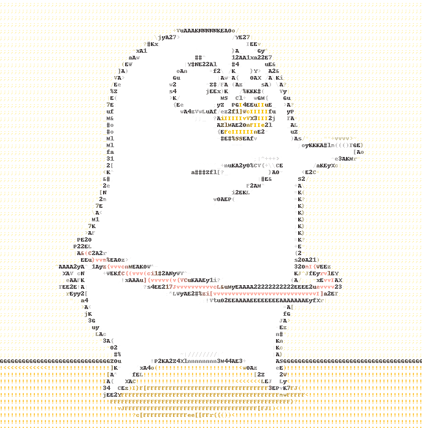

# Ascii Art #
Convert an image to an ascii image or txt.  
Convert a video to an ascii video.
<p align="center">
	
	<br/>
</p>

[简体中文](./README-cn.md)  
[English](./README.md)

## Introduction ##
Inspired by [ASCII-generator](https://github.com/uvipen/ASCII-generator). 
It is good, but has some issues when handling video such as the conversion is slow, output video has no audio.

## Features ##
* :zap: **Make Full Use Of Your CPU**. To shorten the time cost of converting the video, I use multi-processes to speed up the conversion.
* :musical_note: **With Audio**. Output video has the same audio with the input video.
* :warning: **Becareful To The Memory Usage**. Memory usage is large when handling the video. (500 frames * 1080p cost about 3GB)

## Requirements ##
`pip install opencv-python Pillow moviepy numpy`
* **python3.8** (python >= 3.6 should work)
* **opencv**
* **Pillow**
* **moviepy**
* **numpy** (Usually included by opencv)  

## Usage ##
```
usage: ascii_art.py [-h] [-i INPUT] [-o OUTPUT] [-c] [-s SCALE] [--no-audio]

Convert image(video) to image(video)

optional arguments:
  -h, --help			show this help message and exit
  -i INPUT, --input INPUT	Input file path
  -o OUTPUT, --output OUTPUT	Output file path
  -c, --color 			Need color or just the greyscale?
  -s SCALE, --scale SCALE 	The higher scale, the bigger output size and the better quality.(default is 1)
  --no-audio			Need audio ?
```

## Example ##
### From image to image ###
```python
# If you want convert from image to image, or from video to video, the output file path can be omitted.
python ascii_art.py -i pic/xly.jpg  -o xly_100.jpg -c # default value of -s option is 1.0
python ascii_art.py -i pic/xly.jpg  # no color, the output file path is ./AsciiArt_xly.jpg
python ascii_art.py -i pic/xly.jpg -o xly_50.jpg -s 0.5 -c
python ascii_art.py -i pic/xly.jpg -o xly_200.jpg -s 2 -c
```
<p align="center">
	
	
	
	
</p>

### From video(or gif) to video(or gif) ###
```python
python ascii_art.py -i pic/xly.gif # no color, the output file path is ./AsciiArt_xly.gif
python ascii_art.py -i pic/xly.gif -o xly_200.jpg -s 2 -c
python ascii_art.py -i pic/xly.gif -o xly_400.jpg -s 4 -c
```
<p align="center">
	<!---->
	
	
	
	
</p>

### From image to txt ###
```python
python ascii_art.py -i pic/xly.jpg -o xly_txt.txt -s 0.4
cat xly_txt.txt
```
```
{{{{{{{{{{{{{{{{{{{{{{{{{{{{{{{{{{{{{{{{{{{{{{{{{{{{{{{{{{{{
{{{{{{{{{{{{{{{{{{{{{{{{{{{{{{{{{{{{{{{{{{{{{{{{{{{{{{{{{{{{
{{{{{{{{{{{{{{{{{{{{{{{{{{{{{{{{{{{{{{{{{{{{{{{{{{{{{{{{{{{{
{{{{{{{{{{{{{{{{{{{{{{{{{{{{{{{{{{{{{{{{{{{{{{{{{{{{{{{{{{{{
{{{{{{{{{{{{{{{{{{{{{{{{{{{{{{{{{{{{{{{{{{{{{{{{{{{{{{{{{{{{
{{{{{{{{{{{{{{{{{{{{{{{{{{{{{{{{{{{{{{{ZXf{{{{{{{{{{{{{{{{{{
{{{{{{{{{{{{{{{{{{{{{M\"G{{{{I(fZZMZIvO||^l{{{{{{{{{{{{{{{{{
{{{{{{{{{{{{{{{{{{{{cZ||"GMZ|^|||||M=|||||MGc{{{{{{{{{{{{{{{
{{{{{{{{{{{{{{{{{{{{M<M|||||^ZZZM~|^^|^|||||^GG{{{{{{{{{{{{{
{{{{{{{{{{{{{{{{{{{sZ||^GZc`...```.`..'GZ||||||IZ{{{{{{{{{{{
{{{{{{{{{{{{c{{{{{f+\G,.`.`.`...........`.iy|^|||Sr{{{{{{{{{
{{{{{{{v:I{{{c{c}M|G:ZZ`.,#Z,...`G'.`..`%Z`.t3||^|;G{{{{{{{{
{{{{{({>c{{{{{{v%^Mf'.`.`.`.f_``M...`.....Z.`,G|||||O{{{{{{{
{{I,,,{{{{{IcIIZ=f>`.ZG,.`.`.Z.(,.GZ%.`.`.Z,`.:G|||^zv{{{{{{
{{{{;{{{{{{{{cM|M,G,.#G.`...,T.'M...`..`..Z..`.M^|||^M{{{{{{
{{{{{{{SMZZG{3^|x.`M`..`.`.X3...,f`.`.`.XM`4P..W^^|||G{SG{{{
{{{{{Z}}}}}Z{M^M'...`%ZMZZ-._MZ3-```:v.`.`.M`M,"|||^|MM,O}{{
{{{{{G}1}}}G{Z|Z,`...`.'MZftyM?MvZG({M.`,O(GZM`,3|^||ZcM{{{{
{{{{{IJ}}}}McM|\M..`...OX(((v(((((v((Z```.'GZ,G`..`MZ]c`[f?{
{{{{}G.,M}}JIZ^|3`..`.`.`ZGZGZMMZf((v#.`.,.`,ZfM``....,MGv{{
{{{{Z.ZG}}}[j{f|^Z...`.`.M(((((v(v(Zt.`.,.``~G|MMZ,``...GI{{
{{{{f...MI{{{{{OGXvZ..`...&ZZGMZZM,`..```.fZZM:ccu.Z.`..MI{{
{{{{vM.`.``OZZJ.:G,uMG`.`.......`...``_MMJ{cv;{Z,..`...'M{{c
{{{{{{M`..........Mo/}`c}oMGMMZZGZM{c,}}c,}>c#u.`.`.`.:MI{{{
{{{{{{{}f,..`.......Mi,}}c'eG{MGr}cc,,}}crcau.`...`..`~G{{{{
{{{{{{{{{{v{MZZZ;`..`:Zyc,{cc{u{I?,cr}}-{MM:`.`.`....`.Z{{{{
{{{{{{{{{{{{{I{M`...``..^Z'`'J}}cc,},c}M%.`.`...```...`Z{{{{
{{{{{{{{{{{{{{{Z,.........,Zcc,cc``c[Z`......`...``....ZI{{{
{{{{{{{{{{{{{{{G,............MCcc}M,..``......`.`......,{{{{
{{{{{{{{{{{{{{{Z.......`.......',``....................`Z{{{
{{{{{{{{{{{{{{{M...............`...``..................,Z{{{
{{{{{{{{{{{{{{{M......`.....`..........................`Z{{{
{{{{{{{{{{{{{{{Z........................................f{{{
```

## References ##
Inspired by [ASCII-generator](https://github.com/uvipen/ASCII-generator).  
The author of this cute duck: [刘阿圆](https://weibo.com/u/1774894770)

